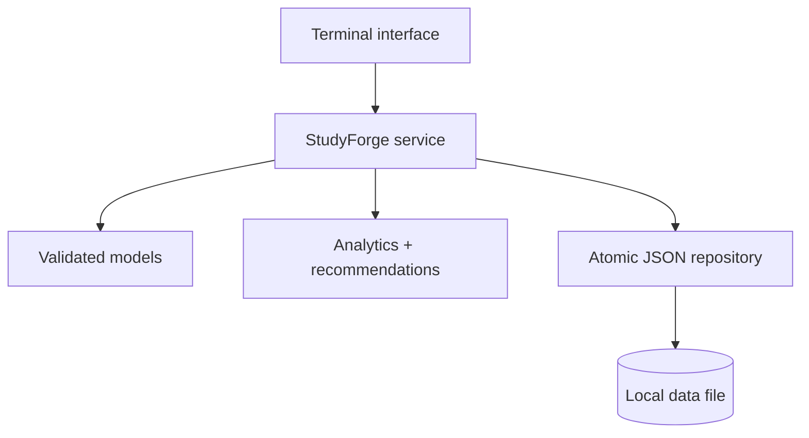

<p align="center">
  
</p>

<p align="center">
  A focused Python study manager for turning time and recall into useful next steps.
</p>

<p align="center">
  <a href="https://github.com/rayan-harb/studyforge/actions/workflows/tests.yml"></a>
  
  
  
</p>

## Why StudyForge?

Studying produces plenty of activity, but it can be hard to tell whether that activity is balanced or effective. StudyForge brings two useful signals together in one terminal application:

- **effort**, measured through focused study sessions and weekly totals;
- **recall**, measured through persistent flashcards and quiz accuracy.

The result is more than a timer or flashcard deck. StudyForge recommends what to work on next using your weakest quiz performance first, then the subjects receiving the least attention.

## What it does

| Area | Capabilities |
|---|---|
| Session tracking | Log dated study blocks, filter history, and total time by subject or date range |
| Active recall | Create persistent flashcards, filter by subject, and run randomized quizzes |
| Analytics | Compare subject totals, review six-week trends, and track quiz accuracy |
| Recommendations | Surface a weak quiz subject or an under-studied subject as the next priority |
| Data safety | Validate inputs and save versioned JSON through atomic file replacement |

## Quick start

StudyForge requires Python 3.11 or newer and has no runtime dependencies.

```bash
git clone https://github.com/rayan-harb/studyforge.git
cd studyforge
python -m venv .venv
```

Activate the environment:

```bash
# macOS/Linux
source .venv/bin/activate

# Windows PowerShell
.venv\Scripts\Activate.ps1
```

Install and launch:

```bash
python -m pip install -e .
studyforge
```

To keep the data file somewhere else:

```bash
studyforge --data path/to/my-study-data.json
```

## A short walkthrough

```text
╭────────────────── STUDYFORGE ──────────────────╮
│  1  Dashboard       5  Browse flashcards       │
│  2  Log session     6  Start quiz              │
│  3  Session history 7  Personalized next step  │
│  4  Add flashcard   8  Exit                    │
╰─────────────────────────────────────────────────╯

Choose 1–8: 1

Total focused time: 165 minutes
  Calculus                  105 min
  Python                     60 min

Quiz accuracy:
  Calculus                   66.7%
  Python                    100.0%

Choose 1–8: 7

Review Calculus: current quiz accuracy is 66.7%.
```

The repository contains no personal study records. Runtime data is written to `data/studyforge.json`, which Git ignores by default.

## Design



The interface, application logic, models, and storage are deliberately separated. That makes the behavior testable without scripting a terminal and allows a future web or desktop interface to reuse the same core.

Read [the architecture notes](docs/architecture.md) for the design decisions and data schema.

## Quality checks

```bash
python -m pip install -e ".[dev]"
pytest
ruff check .
```

The test suite covers validation, JSON round trips, corrupt-data handling, analytics, filtering, quiz results, recommendations, and full interactive CLI flows. GitHub Actions runs the checks on Python 3.11, 3.12, and 3.13.

## Project background

StudyForge is the portfolio evolution of my individual MSE 121 terminal project. The original application established the core workflow—study-session tracking, subject statistics, flashcards, quizzes, and local persistence. This edition was rebuilt outside the private GitHub Classroom repository with a package architecture, safer storage, stricter validation, expanded analytics, and automated tests.

See [project history](docs/project-history.md) for a transparent breakdown of what changed.

## Roadmap

- Export summaries to CSV
- Add optional spaced-repetition scheduling
- Support a reusable web interface over the same service layer

## License

Released under the [MIT License](LICENSE).

